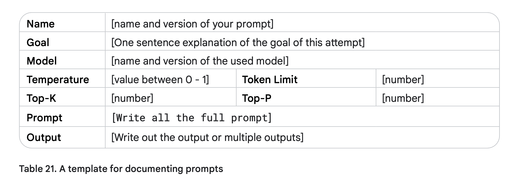

# Best Practices for writing an effective prompt

## The techniques we go through

- `Zero shot prompting`
- `Few shot prompting`
- `System prompting`: The behavior, instruction of the model
- `Role prompting`: The tone, base of response
- `Contextual prompting`: The additional information
- `Step-back prompting`: Talk about the explicit knowledge and then use it to solve the problem
- `Chain of thought`: The step-by-step reasoning or imitation of human thinking
- `Self-consistency`: Voting mechanism
- `Tree of thoughts`: Find the best path
- `ReAct(Reasoning and Act)`: Agentic prompting(the reasoning, acting and observation loop)
- `Automating prompting`: Use the prompt to generate the prompt, basically to use voting to find the best prompt

## Use verbs to describe the action

- Act, Analyze, Categorize, Classify, Contrast, Compare, Create, Describe, Define, Evaluate, Extract, Find, Generate, Identify, List, Measure, Organize, Parse, Pick, Predict, Provide, Rank, Recommend, Return, Retrieve, Rewrite, Select, Show, Sort, Summarize, Translate, Write and so on.

## Use positive instructions rather than constraints

- It gives flexibility and encourages creativity within the defined boundaries, while constraints can limit the model’s potential.

## Use few shot examples

- A good rule of thumb is to start with `6` few shot examples and start testing the accuracy from there.

## Use the combination of temperature, top-k and top-p

- But for CoT prompting, set the temperature to 0, one way to solve.

## Document the prompt attempts and results of history

- So you can learn over time what went well and what did not.

## Seperate the prompt from code to make it easier to maintain

- You can upgrade and reuse the prompt in different projects.

## Resource

- Google whitepaper of prompt engineering, 2025.02